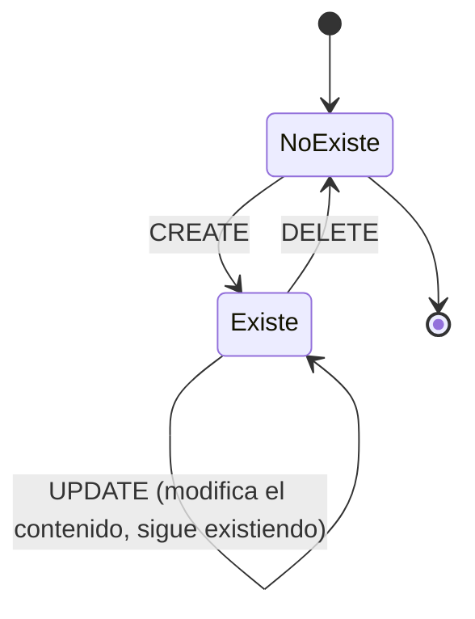
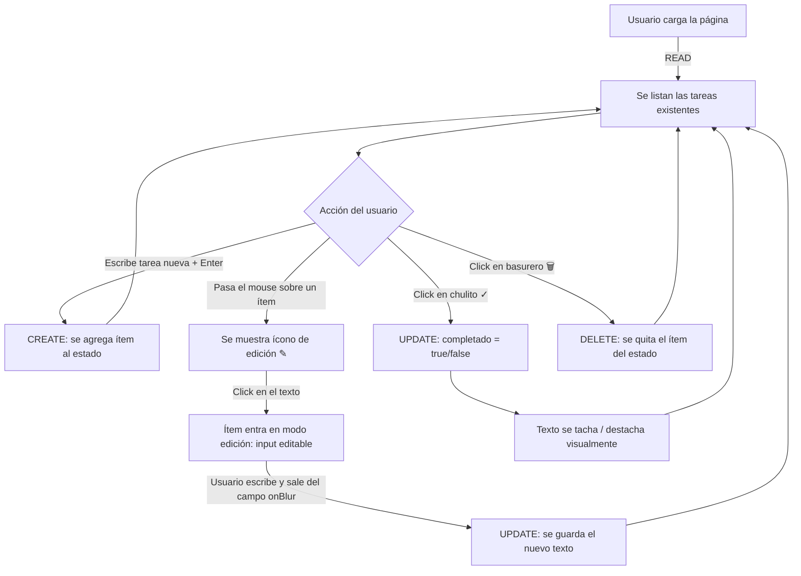

# Práctica TODO List (CRUD)

> Objetivo de esta primera entrega: entender, a nivel de ingeniería de software, **qué es cada archivo del proyecto** y **qué ocurre ** cuando una app hecha con React/Next.js se ejecuta — desde el código fuente hasta lo que ve el usuario en el navegador. 

----------

## 1. Punto de partida: ¿qué tipo de "traducción" necesita el navegador?

El navegador **solo** entiende tres lenguajes de forma nativa: **HTML** (estructura/DOM), **CSS** (estilos) y **JavaScript** (comportamiento, vía el motor JS — V8 en Chrome, SpiderMonkey en Firefox, JavaScriptCore en Safari). Todo lo demás (JSX, TypeScript, Sass, módulos ES con `import`/`export` en algunos contextos, etc.) es **azúcar sintáctico o lenguaje de más alto nivel** que debe transformarse antes de llegar al navegador.

Esto es exactamente el mismo problema que resuelve un compilador de C: el procesador de tu computadora no entiende C, entiende **código máquina**. GCC es la cadena de herramientas que traduce de un lenguaje de alto nivel (C) a algo que la CPU puede ejecutar directamente. React/Next.js resuelven un problema análogo: traducir JSX/JS moderno a JS que el navegador (o Node.js, en el caso del servidor) puede ejecutar directamente.

----------

## 2. Analogía: el pipeline de GCC (C) explicado por fases

Cuando compilas un programa en C con `gcc programa.c -o programa`, realmente ocurren **4 fases secuenciales**, aunque parezca un solo comando:

Fase

Herramienta

Entrada

Salida

Qué hace

1. Preprocesamiento

`cpp` (preprocesador)

`programa.c`

`programa.i`

Expande macros (`#define`), resuelve directivas (`#include`), elimina comentarios. Es texto plano todavía.

2. Compilación

`cc1` (compilador propiamente dicho)

`programa.i`

`programa.s`

Traduce el C expandido a **código ensamblador** (assembly) para la arquitectura destino (x86-64, ARM, etc.). Aquí se hace el análisis léxico, sintáctico, semántico y la generación de código intermedio/optimización.

3. Ensamblado

`as` (assembler)

`programa.s`

`programa.o`

Traduce assembly a **código máquina binario relocalizable** (object file, formato ELF/COFF/Mach-O).

4. Enlazado (linking)

`ld` (linker)

`programa.o` + librerías (`.a`/`.so`)

`programa` (ejecutable)

Resuelve referencias externas (p. ej. `printf` de la libc), combina todos los `.o` en un único binario ejecutable y coloca direcciones de memoria definitivas.

Puedes ver cada fase por separado:

```bash
gcc -E programa.c -o programa.i   # solo preprocesar
gcc -S programa.i -o programa.s   # solo compilar a assembly
gcc -c programa.s -o programa.o   # solo ensamblar
gcc programa.o -o programa        # solo enlazar

```

El punto clave: **hay una cadena de transformaciones de un lenguaje a otro, cada una manejada por una herramienta especializada**, hasta llegar a un formato que la máquina destino puede ejecutar directamente. Esa misma lógica de "pipeline de herramientas" es la que usa el ecosistema React/Next.js, solo que el "destino" no es una CPU sino el **motor de JavaScript del navegador** (o el runtime de Node.js/Edge en el servidor).

----------

## 3. Anatomía del proyecto: qué es cada tipo de archivo

En un proyecto Next.js (que hoy en día es la forma recomendada oficialmente de "instalar React", como se explica en la sección 6) te vas a encontrar, entre otros, con:

Archivo / carpeta

Rol

Analogía con C

`package.json`

Manifiesto del proyecto: nombre, versión, **dependencias** (`react`, `react-dom`, `next`) y _scripts_ (`dev`, `build`, `start`).

Como un `Makefile`: declara qué se necesita y cómo se construye.

`package-lock.json` / `node_modules/`

Versión exacta de cada dependencia instalada, y el código fuente descargado de esas dependencias.

Como las librerías estáticas/dinámicas (`.a`, `.so`) que enlaza `ld`.

`*.jsx` / `*.tsx`

Componentes de React escritos en **JSX** (JavaScript + una sintaxis tipo XML/HTML embebida) o **TSX** (JSX + TypeScript). **No es HTML real**, es azúcar sintáctico sobre JavaScript.

Como el `.c` fuente: es lo que escribe el humano, no lo que ejecuta la máquina.

`*.js` / `*.ts`

Lógica pura de JavaScript/TypeScript sin marcado JSX (utilidades, hooks, lógica de negocio).

—

`*.css` / `*.module.css`

Hojas de estilo. Los `.module.css` generan nombres de clase únicos por componente (evitan colisiones globales).

—

`*.html`

En un proyecto Next.js normalmente **no escribes tú el HTML final** — se genera dinámicamente. En proyectos React "puros" con Vite/Webpack, sí existe un único `index.html` con un `<div id="root">` como contenedor vacío donde React inyecta todo.

El `.html` es el "molde" análogo al ejecutable vacío antes del _linking_ final: un contenedor que se llena en tiempo de ejecución.

`next.config.js`

Configuración del _build_: manejo de imágenes, redirecciones, variables de entorno, etc.

Como flags/opciones que le pasarías a `gcc` (`-O2`, `-I`, `-D`).

Carpeta `app/` (o `pages/`)

Convención de **enrutamiento basado en archivos** de Next.js: cada archivo/carpeta define una ruta URL automáticamente. Se explica en la sección 6.

No tiene analogía directa en C; es la parte "framework" que reemplaza configuración manual.

----------

## 4. Qué pasa realmente cuando "corres" una app en React / Next.js

Igual que en C hay 4 fases (preprocesar → compilar → ensamblar → enlazar), en React/Next.js hay un pipeline equivalente, aunque con nombres distintos:

Fase

Herramienta típica

Entrada

Salida

Qué hace

1. Transpilación de JSX/TS

**Babel** (React clásico) o **SWC** (Next.js, escrito en Rust, mucho más rápido que Babel)

`App.jsx`

JS puro (llamadas a `React.createElement()` o al _JSX runtime_ automático `jsx()`/`jsxs()`)

El JSX `<h1>Hola</h1>` se traduce a algo como `jsx("h1", {children: "Hola"})`. El navegador nunca ve JSX.

2. Transpilación de sintaxis moderna

Babel/SWC

JS con sintaxis ES2023+, TypeScript

JS compatible con los navegadores destino (_targets_)

Similar a cómo `cc1` adapta el código a una arquitectura de CPU concreta: aquí se adapta a un conjunto de navegadores concreto (`browserslist`).

3. Empaquetado (_bundling_)

**Webpack** (histórico) o **Turbopack** (bundler nativo de Next.js, también en Rust)

Decenas/cientos de módulos JS/CSS interconectados por `import`/`export`

Uno o varios _bundles_ (`.js`) optimizados, con _code-splitting_ por ruta

Resuelve el grafo de dependencias entre módulos y produce artefactos finales — el equivalente directo al **linker** de C, que resuelve referencias entre `.o` y produce el binario final.

4. Minificación/optimización

Terser, SWC minifier

Bundle sin comprimir

Bundle minificado (nombres cortos, código muerto eliminado — _tree-shaking_)

Análogo a las optimizaciones `-O2`/`-O3` de GCC.

5. Ejecución

Motor JS del navegador (V8, etc.) — **o** Node.js/Edge Runtime si es renderizado en servidor

Bundle final

UI interactiva en pantalla

Aquí es donde React realmente "corre": ejecuta las funciones componente, construye el Virtual DOM y lo reconcilia con el DOM real (ver sección 5).

**Diferencia importante frente a C:** en C, el binario final ya contiene código máquina — no hay "intérprete" corriendo por debajo (salvo el sistema operativo). En React/Next.js, el resultado del _build_ sigue siendo **JavaScript**, que a su vez es interpretado/compilado JIT (_Just-In-Time_) por el motor del navegador en tiempo de ejecución. Es decir: el pipeline de React termina en un lenguaje de alto nivel (JS), no en código máquina — el motor V8 es el que hace el trabajo final de compilación JIT, de forma transparente para ti.

### Diagrama comparativo (ASCII)

```
 PIPELINE DE C (GCC)                         PIPELINE DE REACT / NEXT.JS
 ─────────────────────                       ────────────────────────────

 programa.c                                   App.jsx  Home.jsx  styles.css
     │  cpp (preprocesador)                       │  Babel / SWC
     ▼  expande macros, #include                  ▼  JSX -> JS (jsx(), createElement)
 programa.i                                   módulos .js (uno por componente)
     │  cc1 (compilador)                          │  Babel / SWC (transpile ES moderno)
     ▼  C -> assembly                             ▼  JS moderno -> JS compatible navegador
 programa.s                                   módulos .js "transpilados"
     │  as (ensamblador)                           │  Webpack / Turbopack (bundler)
     ▼  assembly -> código máquina relocalizable    ▼  resuelve imports, arma el grafo
 programa.o (+ otros .o)                       chunks / bundle.js (+ CSS extraído)
     │  ld (linker)                                │  Terser / SWC minifier
     ▼  resuelve símbolos, arma el binario final    ▼  minifica, tree-shaking
 programa (ejecutable, código máquina)          bundle final (JavaScript optimizado)
     │  Sistema Operativo carga el binario          │  Navegador descarga el bundle
     ▼  la CPU ejecuta instrucciones directamente    ▼  motor JS (V8) interpreta/JIT-compila
 Proceso corriendo en RAM                        React ejecuta los componentes,
                                                  construye el Virtual DOM,
                                                  reconcilia contra el DOM real,
                                                  el navegador pinta la pantalla

```

**Nota sobre Next.js específicamente:** a diferencia de una app React "pura" (SPA, hecha con Vite), Next.js puede ejecutar parte de este pipeline **en el servidor** (Node.js/Edge Runtime) en vez de únicamente en el navegador del usuario. Esto se llama _Server-Side Rendering_ (SSR) o _Static Site Generation_ (SSG): el HTML ya viene "pre-armado" desde el servidor, y el JS que llega al navegador solo necesita "hidratar" (_hydration_) ese HTML para hacerlo interactivo, en lugar de construir todo el DOM desde cero en el cliente.

----------

## 5. DOM vs. Virtual DOM (React DOM): qué son y por qué la diferencia importa

### 5.1 El DOM (Document Object Model)

El **DOM** es la representación en memoria, estandarizada por el W3C/WHATWG, de un documento HTML como un **árbol de objetos** manipulable con JavaScript (`document.createElement`, `document.getElementById`, etc.). Cada nodo del árbol (`<div>`, `<p>`, texto...) es un objeto real del navegador, con decenas de propiedades y conectado al motor de renderizado (_layout_, _paint_, _composite_).

**El problema:** manipular el DOM real es **costoso computacionalmente**. Cada cambio (agregar un nodo, cambiar un atributo) puede disparar recálculos de _layout_ (reflow) y repintado (_repaint_) de la página. Si actualizas el DOM real decenas de veces por segundo de forma directa e ingenua, el rendimiento se degrada notablemente, sobre todo en listas grandes (como una TODO list con muchos ítems).

### 5.2 El Virtual DOM de React

React resuelve esto con una capa intermedia llamada **Virtual DOM**: una representación **ligera, en memoria, de objetos JavaScript planos** (no objetos reales del navegador) que describe cómo debería lucir la UI en un momento dado. Cuando el estado de un componente cambia:

1.  React genera un **nuevo árbol de Virtual DOM** describiendo la UI resultante.
2.  React lo compara (_diffing_) contra el árbol de Virtual DOM anterior, mediante un algoritmo llamado **reconciliación**.
3.  React calcula el **conjunto mínimo de cambios** reales necesarios.
4.  **React DOM** (la librería que conecta React con el navegador — separada del "core" de React, que también puede correr en React Native, por ejemplo) aplica esos cambios mínimos al DOM real, en lote (_batching_).

### 5.3 Tabla comparativa

Aspecto

DOM (real)

Virtual DOM (React)

Naturaleza

Árbol de objetos nativos del navegador

Árbol de objetos JS planos (`{type, props, children}`)

Costo de escritura

Alto: puede disparar _reflow_/_repaint_

Bajo: es solo un objeto en memoria de JS

Quién lo actualiza

El desarrollador, directamente (`element.innerHTML = ...`) o el navegador

React internamente, vía reconciliación

Actualización

Inmediata, uno a uno

Por lotes (_batching_), aplicando solo el _diff_ mínimo al DOM real

Rol de "React DOM"

—

Es el paquete (`react-dom`) que traduce el resultado de la reconciliación en operaciones reales sobre el DOM del navegador (`react-dom/client` en React 18/19, con `createRoot`)

**Aclaración importante (y honesta):** desde hace varias versiones, el propio equipo de React ha sido cuidadoso en aclarar que el Virtual DOM **no es "más rápido" por arte de magia** ni una silver bullet — la ganancia real viene de que React minimiza y agrupa las mutaciones costosas del DOM real, y de que le permite al desarrollador escribir la UI de forma **declarativa** ("así debe verse la UI dado este estado") en vez de **imperativa** ("hacé estos pasos para mutar el DOM"). Esa es la ventaja de fondo: menos errores de sincronización manual, no una promesa absoluta de velocidad.

----------

## 6. ¿Por qué React ahora "es" Next.js? El paso del build tool al framework

Un punto de confusión frecuente (y por eso lo aclaramos aquí, con base científica): **React sigue siendo React** (la librería de UI, mantenida por Meta). Lo que cambió es **cómo se recomienda arrancar un proyecto nuevo**.

### 6.1 Qué pasó con Create React App (CRA)

Durante años, `npx create-react-app` fue la forma oficial de iniciar un proyecto React: entregaba un _build tool_ ya configurado (Webpack + Babel + ESLint) pero **sin opinión sobre routing, _data fetching_ ni _code splitting_**. El **14 de febrero de 2025**, el equipo oficial de React anunció formalmente en su blog (react.dev) que **Create React App queda deprecado para proyectos nuevos**, señalando que ya no tiene mantenedores activos y que herramientas como Next.js, React Router (en modo framework) o Expo resuelven mejor esos problemas de forma integrada.

### 6.2 Por qué un _build tool_ (como CRA o Vite solos) se queda corto

Según la propia documentación oficial de React, un _build tool_ sin más te da JSX, _linting_ y un bundler — pero deja sin resolver, entre otros:

-   **Enrutamiento (routing):** sin una librería/framework, cambiar de "página" en una SPA hecha con CRA se hace manejando estado manualmente (`useState`), lo que **no genera URLs reales** ni permite compartir enlaces directos a una vista concreta.
-   **Data fetching:** buscar datos dentro de un componente (`useEffect` + `fetch`) genera _network waterfalls_ (esperas en cascada), porque los datos se piden recién cuando el componente ya se renderizó.
-   **Code splitting:** sin integración con el router, es difícil descargar solo el código JS que la ruta actual necesita.
-   Además: _streaming_, _server-side rendering_, _static-site generation_, manejo de estados de carga/errores de navegación, accesibilidad de foco entre rutas, etc.

Resolver todo esto "a mano" termina reconstruyendo, en la práctica, un framework casero encima del _build tool_ — que es precisamente el problema que CRA había intentado resolver en 2016 (evitar configurar Webpack/Babel a mano).

### 6.3 Qué agrega Next.js concretamente (comparado con "React puro")

Necesidad

React "puro" (Vite/CRA + libs sueltas)

Next.js

Routing

Requiere instalar React Router y configurarlo manualmente

**Enrutamiento basado en archivos**: crear `app/tareas/page.jsx` genera automáticamente la ruta `/tareas`. No hay que declarar rutas a mano.

Renderizado

Solo _client-side rendering_ (todo el JS se descarga y renderiza en el navegador)

Soporta **SSR, SSG e ISR** además de CSR — se elige por página/ruta según convenga.

Data fetching

Librerías externas (TanStack Query, SWR) conectadas a mano al router

Integrado: _Server Components_ y funciones `loader`/`fetch` a nivel de servidor, evitando _waterfalls_.

Code splitting

Manual, vía `React.lazy`

Automático por ruta, integrado con el router.

API backend propia

Requiere un servidor aparte (Express, etc.)

_Route Handlers_ dentro del mismo proyecto (`app/api/.../route.js`) — útil para el CRUD del backend de la TODO list.

Bundler/compilador

Webpack + Babel (o Vite + esbuild)

**Turbopack** (dev) y **SWC** (compilación), ambos escritos en Rust — reemplazo más rápido de Webpack/Babel.

En otras palabras: **Next.js no reemplaza a React, lo envuelve como "metaframework"**, agregando exactamente las piezas (routing, _data fetching_, _rendering_ híbrido servidor/cliente, _bundling_ optimizado) que React por sí solo, deliberadamente, no incluye — porque React es una librería de UI (la "V" de un patrón MVC, a grandes rasgos), no un framework de aplicación completo. Por eso, para _este_ proyecto de TODO list con CRUD, usar Next.js nos da de fábrica: el archivo único de rutas (`app/`), la posibilidad de manejar el CRUD como _Route Handlers_ (API) sin backend aparte, y una compilación (SWC/Turbopack) más rápida que la cadena Babel+Webpack clásica.

----------

## 7. NUTSHELL

1.  El navegador solo ejecuta HTML/CSS/JS nativamente; JSX/TS necesitan un pipeline de transformación, igual que C necesita el pipeline de GCC (preprocesar → compilar → ensamblar → enlazar).
2.  En React/Next.js ese pipeline es: **JSX/TS → transpilación (Babel/SWC) → bundling (Webpack/Turbopack) → minificación → ejecución en el motor JS del navegador (o en Node/Edge si hay SSR)**.
3.  El resultado final del pipeline de C es código máquina; el resultado final del pipeline de React sigue siendo **JavaScript**, que el motor del navegador compila/interpreta en tiempo de ejecución (JIT).
4.  El **DOM** es el árbol real y costoso de manipular; el **Virtual DOM** es una capa en memoria que React usa para calcular el mínimo de cambios necesarios, y **React DOM** es el paquete que aplica esos cambios al DOM real.
5.  React dejó de recomendar _build tools_ solos (como Create React App, deprecado oficialmente el 14 de febrero de 2025) y ahora recomienda frameworks como **Next.js**, porque resuelven de forma integrada routing, _data fetching_, _code splitting_ y renderizado híbrido — piezas que React, como librería de UI, no resuelve por sí sola.

----------
## 9. Preparando el entorno: instalación de Node.js y Next.js

Antes de escribir una sola línea del CRUD, hay que preparar la máquina. Esto se hace en dos pasos oficiales: instalar **Node.js** (que trae **npm** incluido) y luego usar el instalador oficial de **Next.js** para generar el proyecto.

### 9.1 Instalar Node.js (y entender qué es npm)

**Node.js** es el *runtime* de JavaScript fuera del navegador (basado en el motor V8 de Chrome) que necesitamos para: correr el servidor de desarrollo de Next.js, ejecutar el compilador SWC/Turbopack, y correr los scripts de `package.json`. Sin Node.js instalado, no se puede ni generar ni levantar un proyecto Next.js.

**Pasos:**

1. Ir al sitio oficial: **https://nodejs.org**
2. La página ofrece normalmente dos versiones para descargar:
   - **LTS (Long Term Support)**: versión estable, recomendada para la gran mayoría de proyectos (incluido este). Es la que hay que elegir.
   - **Current**: versión más reciente con features experimentales, pensada para probar novedades, no para producción.
3. Descargar el instalador correspondiente al sistema operativo (Windows `.msi`, macOS `.pkg`, o usar un gestor de paquetes en Linux, p. ej. `apt`, `dnf`, o `nvm` para manejar varias versiones de Node en paralelo).
4. Ejecutar el instalador con las opciones por defecto. El instalador oficial de Node.js **incluye npm automáticamente** — no hace falta instalarlo aparte.
5. Verificar la instalación abriendo una terminal y corriendo:

```bash
node -v
npm -v
```

   Esto debe mostrar los números de versión instalados (por ejemplo `v22.x.x` y `10.x.x`). Next.js requiere como mínimo **Node.js 20.9** o superior según la documentación oficial de instalación de Next.js.

**¿Qué es npm?**

**npm** (*Node Package Manager*) es, a la vez, tres cosas:

1. **Un gestor de paquetes** (un programa de línea de comandos, `npm`) que instala, actualiza y elimina dependencias (librerías de código de terceros) que tu proyecto necesita — como `react`, `react-dom` o `next`.
2. **Un registro público** (el sitio `registry.npmjs.org` / `npmjs.com`) donde miles de desarrolladores publican esos paquetes para que cualquiera los descargue.
3. **Un ejecutor de scripts**, definidos dentro de `package.json` en la clave `"scripts"` (por ejemplo `npm run dev`, `npm run build`), que sirven como atajos a comandos más largos.

Cuando corrés `npm install <paquete>`, npm: (a) busca el paquete en el registro, (b) lo descarga junto con **sus propias dependencias** (de forma recursiva, armando un árbol de dependencias), (c) los guarda todos dentro de la carpeta `node_modules/`, y (d) anota la versión exacta instalada en `package-lock.json`, para que cualquier otra persona que clone el proyecto instale exactamente las mismas versiones y evite el clásico problema de "en mi máquina funciona".

> **Nota:** junto con Node.js también existe `npx`, una herramienta (incluida desde npm 5.2+) que permite **ejecutar** un paquete sin instalarlo permanentemente en el proyecto — es justamente lo que se usa para generar un proyecto Next.js nuevo, como se ve a continuación. También existen alternativas a npm como **pnpm** o **yarn**, que hacen lo mismo pero con distintas estrategias de almacenamiento de dependencias; la documentación oficial de Next.js da el comando equivalente para las cuatro opciones (npm, pnpm, yarn, bun).

### 9.2 Instalar (generar) el proyecto Next.js

React, hoy, **no se instala "suelto"** para un proyecto nuevo (ver Parte 1, sección 6) — se instala a través del instalador oficial de un framework, en este caso Next.js.

**Pasos:**

1. Ir al sitio oficial de la documentación: **https://nextjs.org/docs/app/getting-started/installation**
2. Verificar el requisito mínimo indicado ahí: Node.js **20.9** o superior (ya cubierto en el paso anterior).
3. Desde una terminal, ubicado en la carpeta donde querés crear el proyecto, correr el comando oficial:

```bash
npx create-next-app@latest
```

   (`@latest` asegura que se descargue siempre la versión más reciente del instalador, en vez de una copia vieja cacheada.)

4. El instalador (`create-next-app`) hace preguntas interactivas en la terminal. Para este proyecto de TODO list, las respuestas recomendadas son:

```text
What is your project named?              → todo-list-app
Would you like to use TypeScript?         → Yes (opcional, pero recomendado)
Would you like to use ESLint?             → Yes
Would you like to use Tailwind CSS?       → Yes (o No, si vas a escribir tu propio CSS)
Would you like your code inside a src/ directory? → Yes o No, a preferencia
Would you like to use App Router?         → Yes (es el router recomendado actualmente)
Would you like to use Turbopack for `next dev`? → Yes (compilador/bundler más rápido)
Would you like to customize the import alias (@/*)? → No (dejar el valor por defecto)
```

   También existe el modo no interactivo, útil para scripts o para aceptar directamente los valores recomendados por Next.js sin que pregunte nada:

```bash
npx create-next-app@latest todo-list-app --yes
```

5. Terminado el proceso, `create-next-app` ya hizo automáticamente un `npm install` por dentro: la carpeta `node_modules/` con `react`, `react-dom`, `next` y el resto de dependencias queda lista, junto con el `package.json`, la carpeta `app/`, y los archivos de configuración (`next.config.js` o `.ts`, `tsconfig.json` si elegiste TypeScript, etc.).

### 9.3 Levantar el proyecto (servidor de desarrollo)

1. Entrar a la carpeta recién creada:

```bash
cd todo-list-app
```

2. Levantar el servidor de desarrollo, usando el script `dev` definido en `package.json`:

```bash
npm run dev
```

   Internamente esto ejecuta `next dev` (con Turbopack, si se eligió en el paso anterior), que arranca un servidor local con **Hot/Fast Refresh** — los cambios que hagas en el código se reflejan en el navegador sin recargar toda la página ni perder el estado de la app.

3. Abrir el navegador en:

```text
http://localhost:3000
```

   Ahí debería verse la página de bienvenida por defecto de Next.js. A partir de acá, cualquier archivo que crees dentro de `app/` empieza a definir rutas nuevas de la aplicación (esto se detalla en la próxima parte de la guía, junto con la estructura de carpetas y el primer componente checkeable del CRUD).

**Resumen del flujo completo:**

```
nodejs.org  →  instalar Node.js (trae npm)  →  verificar con node -v / npm -v
     │
     ▼
nextjs.org/docs  →  npx create-next-app@latest  →  responder prompts
     │
     ▼
cd todo-list-app  →  npm run dev  →  abrir http://localhost:3000
```

```markdown
## 10. ¿Qué es CRUD? Las 4 operaciones fundamentales sobre un dato

**CRUD** es un acrónimo (viene del inglés) que agrupa las **cuatro operaciones básicas** que se pueden hacer sobre cualquier dato persistente — un registro en una base de datos, un archivo, o (en nuestro caso) un ítem de una lista de tareas:

| Letra | Operación (inglés) | En español | Acción típica |
|---|---|---|---|
| **C** | Create | Crear | Generar un nuevo registro que antes no existía |
| **R** | Read | Leer | Consultar/mostrar uno o varios registros existentes |
| **U** | Update | Actualizar | Modificar un registro que ya existe, sin borrarlo |
| **D** | Delete | Eliminar | Borrar un registro existente de forma permanente |

Este acrónimo no es una invención de un framework en particular: es un concepto de **diseño de sistemas de persistencia de datos**, y por eso aparece repetido en distintas capas de la tecnología, con distintos "nombres" pero el mismo significado de fondo:

| Capa / tecnología | Create | Read | Update | Delete |
|---|---|---|---|---|
| **HTTP / API REST** | `POST` | `GET` | `PUT` / `PATCH` | `DELETE` |
| **SQL (bases de datos relacionales)** | `INSERT` | `SELECT` | `UPDATE` | `DELETE` |
| **Nuestra TODO list** | Agregar una tarea nueva | Ver la lista de tareas | Editar el texto de una tarea (o marcarla como completada) | Quitar una tarea de la lista |

### 10.1 La analogía: los "estados de la materia" de un dato

Así como en física un mismo material puede pasar por estados (sólido → líquido → gas) mediante transiciones de energía (calentar, enfriar), un **registro de datos** también pasa por "estados de existencia" mediante transiciones que son, justamente, las operaciones CRUD:



-   **No existe → Existe**: se dispara con **Create**. Es la única operación que "hace nacer" el dato.
-   **Existe → Existe (sin cambiar de estado)**: tanto **Read** como **Update** ocurren mientras el dato ya existe. Read no modifica nada (es una operación de solo lectura / _idempotente_); Update sí modifica el contenido, pero el registro sigue "vivo".
-   **Existe → No existe**: se dispara con **Delete**, y es la única transición que "hace desaparecer" el dato (salvo que se vuelva a crear).

Es una analogía útil precisamente porque, igual que en los estados de la materia hay una **transición controlada** (no podés pasar de sólido a gas sin pasar por líquido, salvo sublimación), en CRUD tampoco podés **Update** o **Delete** algo que nunca pasó por **Create** — y no podés **Read** algo que ya fue eliminado, salvo que technically vuelvas a **Create**-arlo.

### 10.2 Por qué esto importa para la vida de un developer (y en entrevistas técnicas)

-   **Es el patrón detrás de casi cualquier app real.** Una red social "crea" posts, "lee" el feed, "actualiza" un perfil, "elimina" un comentario. Un e-commerce "crea" pedidos, "lee" el catálogo, "actualiza" el stock, "elimina" un producto. Dominar CRUD es, en la práctica, dominar el 80% de la lógica de negocio de cualquier backend o frontend con estado.
-   **Es el lenguaje común entre frontend, backend y base de datos.** Saber que un clic en "Guardar" en la UI corresponde a un `PUT`/`PATCH` en la API, que a su vez corresponde a un `UPDATE` en SQL, te permite razonar sobre un sistema completo de punta a punta, no solo sobre una capa.
-   **En entrevistas técnicas** es extremadamente común que pidan: "diseñá una API REST para X" o "diseñá el esquema de una base de datos para Y" — y la respuesta esperada casi siempre se estructura alrededor de las 4 operaciones CRUD, sus métodos HTTP correctos, sus códigos de estado (`200`, `201 Created`, `204 No Content`, `404 Not Found`, etc.) y su idempotencia (Read, Update y Delete deberían ser _idempotentes_ — repetirlas no debería generar efectos distintos la segunda vez; Create, no).
-   **Te obliga a pensar en el ciclo de vida completo de un dato**, no solo en "cómo se ve en pantalla" — evitando bugs comunes como permitir editar un ítem que ya fue borrado, o mostrar datos que nunca terminaron de crearse.

----------

## 11. Diagrama de funcionamiento y wireframe de la TODO List

Con el CRUD ya entendido conceptualmente, veamos cómo se traduce a **la interacción real de la interfaz** que vamos a construir: una lista de tareas checkeables, editable al pasar el mouse, que guarda al perder el foco, y que se completa/tacha con un botón tipo "chulito" (checkmark).

### 11.1 Mapeo de cada interacción de la UI a su operación CRUD

Interacción del usuario

Operación CRUD

Qué pasa realmente

Escribir una tarea nueva y confirmar (Enter / botón `+`)

**Create**

Se agrega un nuevo ítem al estado de la lista (nuevo objeto `{id, texto, completado}`)

Cargar la página / ver la lista

**Read**

Se muestran todos los ítems actuales del estado (o traídos desde la API/base de datos)

Pasar el mouse por encima de un ítem y editarlo, guardando al salir del campo (`onBlur`)

**Update**

Se modifica el campo `texto` del ítem existente, sin crear uno nuevo ni borrar el anterior

Presionar el botón tipo chulito (✓) para tachar la tarea

**Update** (no Delete)

Se cambia el campo booleano `completado` de `false` a `true` — el ítem **sigue existiendo**, solo cambia visualmente (texto tachado). Es un caso particular de actualización, muy común en apps reales (ej. "archivar", "marcar como leído").

Presionar un botón de basurero (🗑) aparte, para quitar la tarea definitivamente

**Delete**

Se elimina el ítem del estado/lista por completo — esta es la única operación que hace que el ítem deje de existir.

> Aclaración importante de diseño: el botón "chulito que tacha" que pediste es, en términos de CRUD, un **Update** disfrazado de "eliminación visual" (tachar ≠ borrar). Por eso en el wireframe se incluye, además, un botón de basurero separado para el **Delete** real — así el CRUD queda completo y sin ambigüedad, y de paso es el patrón que vas a ver en casi cualquier app de tareas real (Todoist, Notion, Apple Reminders, etc.).

### 11.2 Diagrama de flujo de interacción (estado del componente)



### 11.3 Wireframe (estilo boceto / sketch) — vista de escritorio

```
 ┌───────────────────────────────────────────────────────────┐
 │   ✎  M I   L I S T A   D E   T A R E A S                   │
 ├───────────────────────────────────────────────────────────┤
 │                                                             │
 │   ┌───────────────────────────────────────────┐  ┌──────┐  │
 │   │  + Escribe una nueva tarea...              │  │  +   │  │  ← CREATE
 │   └───────────────────────────────────────────┘  └──────┘  │
 │                                                             │
 │   ───────────────────────────────────────────────────────  │
 │                                                             │
 │   (✓)   S̶o̶l̶i̶c̶i̶t̶a̶r̶ ̶c̶i̶t̶a̶ ̶m̶é̶d̶i̶c̶a̶            🗑     │  ← completado (Update)
 │                                                             │
 │   ( )   Comprar leche y pan               ✎   🗑           │  ← READ + hover (✎ visible)
 │                                                             │
 │   ( )   [ Terminar informe_______________ ]    🗑           │  ← modo edición activo (Update)
 │          ↑ se guarda automáticamente al salir del campo     │
 │                                                             │
 │   ( )   Llamar al dentista                     🗑           │
 │                                                             │
 └───────────────────────────────────────────────────────────┘
     Leyenda:  ( )/( ✓ ) = chulito toggle "completado"   ✎ = aparece solo en hover   🗑 = delete

```

### 11.4 Wireframe responsivo — vista de móvil

```
 ┌───────────────────────┐
 │  ✎ MIS TAREAS          │
 ├───────────────────────┤
 │ ┌───────────────────┐ │
 │ │ + nueva tarea...  │ │   ← input ocupa todo el ancho
 │ └───────────────────┘ │
 │        [ + ]           │   ← botón crear debajo, no al costado
 ├───────────────────────┤
 │ (✓) S̶o̶l̶i̶c̶i̶t̶a̶r̶ ̶c̶i̶t̶a̶     │
 │            🗑          │
 │ ( ) Comprar leche      │   ← en móvil no hay "hover":
 │            ✎   🗑       │     el ícono de editar queda
 │ ( ) Llamar dentista    │     siempre visible (tap directo)
 │            ✎   🗑       │
 └───────────────────────┘

```

**Notas de comportamiento responsivo:**

-   **Desktop:** el ícono de edición (✎) solo aparece con `:hover` sobre el ítem; en móvil no existe el concepto de "hover", así que el ícono queda visible siempre (o se activa con un `tap` que revela las acciones).
-   El input de "nueva tarea" y su botón `+` pasan de estar **en fila** (desktop) a **apilados verticalmente** (móvil) — típico breakpoint con CSS Flexbox/Grid + media query o clases responsivas de Tailwind (`flex-row` → `flex-col`).
-   Cada fila de tarea es un contenedor flexible con 3 zonas: **checkbox/chulito** (izquierda) — **texto/input editable** (centro, ocupa el espacio flexible) — **acciones ✎ 🗑** (derecha), para que se adapte de forma fluida a cualquier ancho de pantalla sin romper el diseño.


## 8. Referencias oficiales

-   React Blog — _Sunsetting Create React App_ (14 feb. 2025): https://react.dev/blog/2025/02/14/sunsetting-create-react-app
-   React Docs — _Creating a React App_: https://react.dev/learn/creating-a-react-app
-   React Docs — _Build a React App from Scratch_: https://react.dev/learn/build-a-react-app-from-scratch
-   React DOM API Reference: https://react.dev/reference/react-dom
-   Next.js Docs — _Routing Fundamentals_: https://nextjs.org/docs/app/building-your-application/routing
-   GNU GCC — _Overview of the compilation process_: https://gcc.gnu.org/onlinedocs/gcc/Overall-Options.html
-   MDN — _Introduction to the DOM_: https://developer.mozilla.org/en-US/docs/Web/API/Document_Object_Model/Introduction

----------
