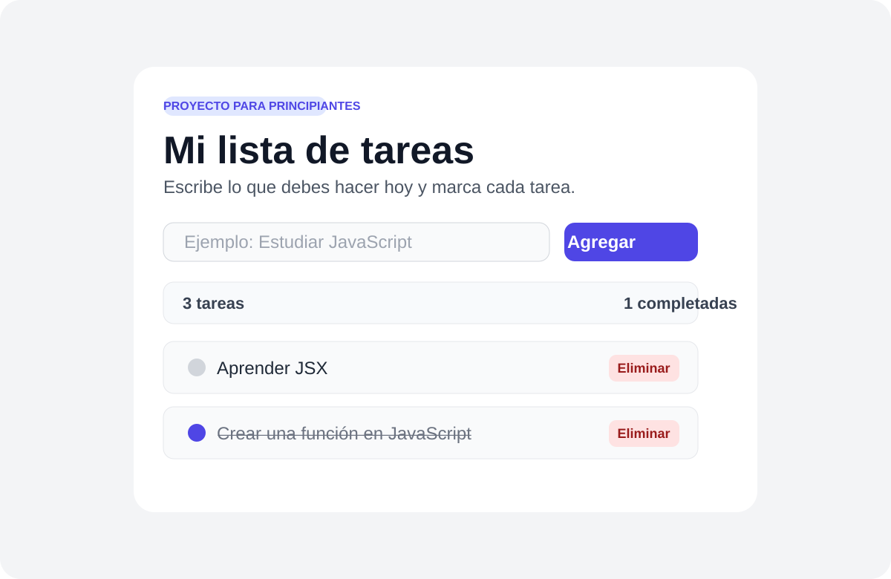

# Mi primer ToDo en Next.js

Este proyecto es una versión muy sencilla y didáctica para que estudiantes principiantes aprendan a crear su primera aplicación con JavaScript y Next.js.

La idea es mostrar de forma clara cómo:

- crear un componente en React
- guardar información con `useState`
- manejar eventos del usuario
- agregar, completar y eliminar tareas
- entender la estructura básica de un proyecto Next.js

## Captura de ejemplo



### Explicación de la pantalla

La interfaz tiene cuatro partes principales:

1. Título principal: indica que esta es una lista de tareas.
2. Campo de texto: permite escribir una nueva tarea.
3. Botón "Agregar": añade la tarea al listado.
4. Lista de tareas: muestra cada actividad con opción de marcarla como completada o eliminarla.

Esto ayuda a explicar que una app de tareas no es solo "texto en pantalla", sino que también responde a la interacción del usuario.

---

## ¿Qué aprenderás?

### 1. Estado con useState
En React, el estado sirve para guardar información que puede cambiar mientras la app está en ejecución.

Por ejemplo:

- lo que escribe el usuario
- la lista de tareas
- si una tarea está completada

### 2. Eventos del usuario
Cuando el usuario escribe o hace clic, se ejecuta una función.

Ejemplo:

- `onChange` para capturar lo que se escribe
- `onClick` para agregar la tarea
- `onKeyDown` para detectar Enter

### 3. Renderizado condicional
Si la lista está vacía, mostramos un mensaje diferente.

Esto se hace con JavaScript dentro de JSX.

---

## Cómo correr el proyecto

Abre la terminal en la carpeta del proyecto y ejecuta:

```bash
npm install
npm run dev
```

Luego abre esta URL en el navegador:

```text
http://localhost:3000
```

---

## Estructura del proyecto

```text
student-todo/
├── app/
│   ├── globals.css
│   ├── layout.js
│   └── page.js
├── public/
│   └── todo-screenshot.svg
├── package.json
├── README.md
└── next.config.mjs
```

---

## Archivo principal a revisar

El archivo más importante para practicar es:

- `app/page.js`

Aquí se encuentra la lógica de la lista de tareas:

- definir el estado
- agregar tareas
- completar tareas
- eliminar tareas

---

## Sugerencia de explicación para estudiantes

Puedes decirles algo como:

> Esta app parece simple, pero ya estamos usando conceptos básicos de JavaScript y React: variables, funciones, eventos, listas y estado. Eso es lo que hace que una aplicación web sea interactiva.

---

## Créditos

Proyecto hecho para fines educativos y para enseñar a estudiantes que están dando sus primeros pasos con JavaScript y Next.js.
